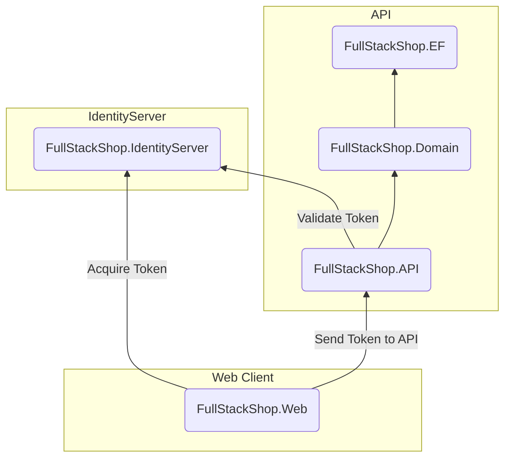

## Project Architecture
The FullStackShop web application uses docker to orchestrate it's services. The front end client for the web application uses Nuxt.js and is located in the [[FullStackShop.Web]] project. The applications web API is located in the [[FullStackShop.API]] project. The web API will be accessing a database using Entity Framework from the [[FullStackShop.EF]] project. The Identity Server project handles authentication and authorization using OIDC and is located in the [[FullStackShop.IdentityServer]] project. The API takes a dependency on the EF project which will contain the domain models and repository interfaces that define how models are accessed.

